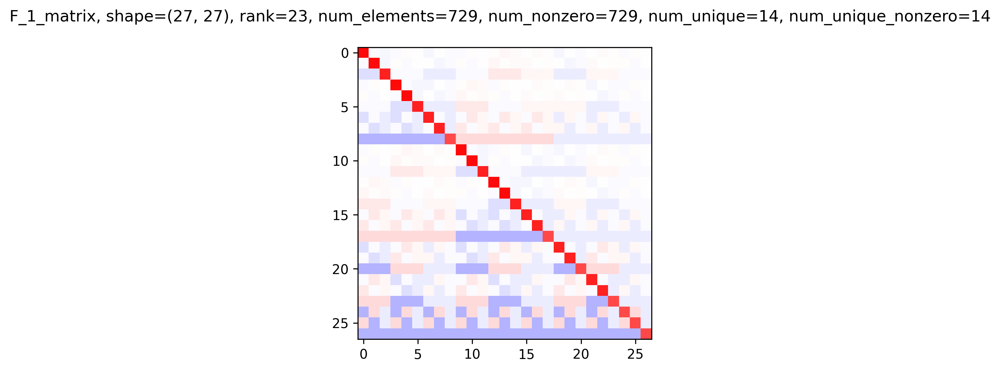
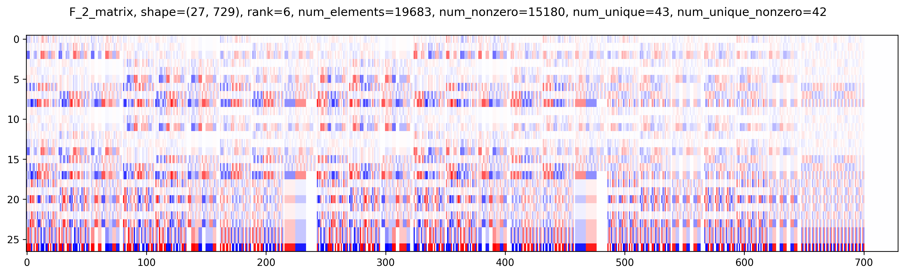

# Quantum Benchmarking (QB): Analysis of Matrices 

This work is supplemental material for the white paper ``Feasibility of accelerating incompressible computational fluid
dynamics simulations with fault-tolerant quantum computers'' (https://arxiv.org/abs/2406.06323).  This includes Python analysis of $F$-matrices (collision matrices) of lattice Boltzmann method (LBM) and the Carleman-linearized $A$-matrix.

In `example_A_norm.ipynb` we establish an upper bound on the spectral norm of the $A$-matrix.  This should be run first to save various matrices in `.npz` format.

In `example_A_norm.py` the actual spectral norm for a *very small* $A$-matrix is calculated.  You can view the results in `example_A_norm.results.txt` instead of actually running the script.  This was split out into a separate script because it tends to crash a default-sized Jupyter kernel.

May/June 2025 updates:
1. The lattice velocity vector table used was updated to reflect Tabl 15
2. The `bounding_A_norm.ipynb` was rearranged and some matrix plots were added, but the results are the same.
3. Added `time_domain_convergence.ipynb` to estimate the physical evolution time $T$ that the truncated Carleman linearized system accurately evolve to.

$F_1$ matrix:

$F_2$ matrix:

$F_3$ matrix:

